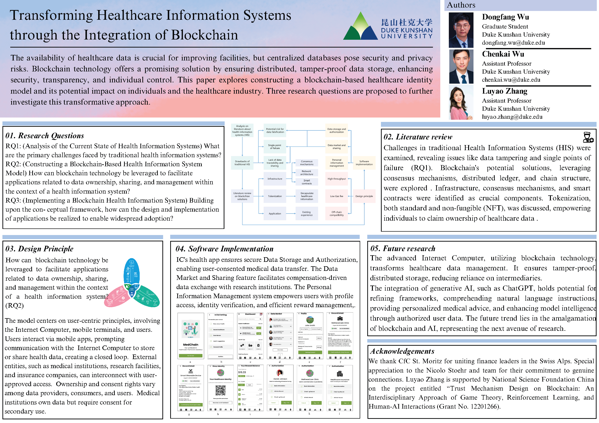

<h1 style="color: green;">github_vscode_test &#x1F60A;</h1>

<!-- Image with a light blue border for a friendly feel -->

<!-- Paragraph with a soft green border, rounded corners, and a light background for an inviting look -->

  
This image represents the cover of an academic paper titled "Transforming Healthcare Information Systems through the Integration of Blockchain" from Duke Kunshan University. &#x1F49A; The paper discusses the integration of blockchain technology into healthcare information systems to improve security, transparency, and control over personal health data. &#x1F4AF; It proposes a new model for healthcare identity management and examines the potential impacts on individuals and the healthcare industry. &#x1F603; Three research questions guide the exploration of this transformative approach. The document includes sections on research questions.

  
  <!-- Hyperlink to the corresponding author's webpage with a positive twist -->
  
Corresponding Author: <a href="https://scholars.duke.edu/person/luyao.zhang" target="_blank">Luyao Zhang</a>

</div